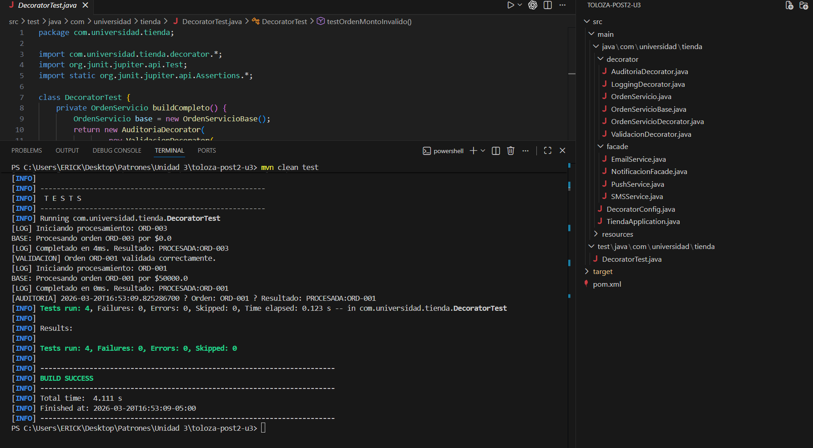

# Patrones de Diseño de Software - Unidad 3: Patrones Estructurales
## Post-Contenido 2: Decorator y Facade

**Programa:** Ingeniería de Sistemas  
**Año:** 2026

---

## Objetivo de la Actividad

Implementar los patrones **Decorator** y **Facade** en un proyecto Spring Boot que modela:
- Un sistema de servicios con capas opcionales de procesamiento (logging, validación, auditoría) sobre un servicio base.
- Una fachada unificada para un subsistema de notificaciones multicanal.

---

## Estructura del Proyecto

```
toloza-post2-u3/
├── pom.xml
├── README.md
├── src/main/java/com/universidad/tienda/
│   ├── TiendaApplication.java
│   ├── DecoratorConfig.java
│   ├── decorator/
│   │   ├── OrdenServicio.java
│   │   ├── OrdenServicioBase.java
│   │   ├── OrdenServicioDecorator.java
│   │   ├── LoggingDecorator.java
│   │   ├── ValidacionDecorator.java
│   │   └── AuditoriaDecorator.java
│   ├── facade/
│   │   ├── EmailService.java
│   │   ├── SMSService.java
│   │   ├── PushService.java
│   │   └── NotificacionFacade.java
│   └── resources/application.properties
├── src/test/java/com/universidad/tienda/DecoratorTest.java
└── image.png
```

---

## Patrón Decorator: Servicio de Órdenes

### Descripción
Se implementa una cadena de decoradores para agregar capas opcionales de procesamiento (logging, validación, auditoría) sin modificar la clase base:

```
[AuditoriaDecorator] → [ValidacionDecorator] → [LoggingDecorator] → [OrdenServicioBase]
```

### Justificación de Uso
- ✅ **Composición sobre herencia:** Sin decoradores, necesitaríamos subclases como `OrdenConLog`, `OrdenConValidacion`, etc. (explosión combinatoria)
- ✅ **Responsabilidad única:** Cada decorador tiene una responsabilidad específica
- ✅ **Open/Closed:** Se pueden agregar nuevas capas sin modificar código existente
- ✅ **Flexibilidad:** El orden y combinación de decoradores es configurable en `@Configuration`


---

## Patrón Facade: Subsistema de Notificaciones

### Descripción
Se implementa una fachada que unifica tres servicios especializados (Email, SMS, Push):

```
[NotificacionFacade] → {EmailService, SMSService, PushService}
```

### Justificación de Uso
- ✅ **Interfaz simplificada:** Una sola llamada notifica por tres canales
- ✅ **Oculta complejidad:** El cliente no conoce los servicios internos
- ✅ **Desacoplamiento:** Cambios internos no afectan al cliente
- ✅ **Fácil extensión:** Agregar nuevos canales sin modificar código existente

---

## Compilación y Ejecución

```bash
# Compilar
mvn clean compile

# Ejecutar tests
mvn clean test

# Empaquetar
mvn clean package
```

---

## Principios SOLID Aplicados

| Principio | Aplicación |
|-----------|-----------|
| **S** | Cada decorador tiene una responsabilidad única |
| **O** | Abierto a extensión (nuevos decoradores), cerrado a modificación |
| **L** | Decoradores intercambiables con `OrdenServicio` |
| **I** | Cada servicio expone solo métodos necesarios |
| **D** | Depende de abstracciones (inyección Spring) |

---

## Checkpoints Verificados

✅ Cadena de decoradores en `DecoratorConfig`  
✅ Orden de ejecución: AUDITORIA → VALIDACION → LOG → BASE  
✅ Excepciones de validación propagadas correctamente  
✅ `NotificacionFacade` notifica por tres canales  
✅ 4 tests JUnit 5 pasando  
✅ Mínimo 3 commits descriptivos

---

## Commits Realizados

1. feat: add pom.xml and OrdenServicio interface
2. feat: implement Decorator pattern classes for order processing
3. feat: implement Facade pattern for notification subsystem
4. feat: add JUnit 5 tests and Spring Boot configuration

---

## Salida de Consola

